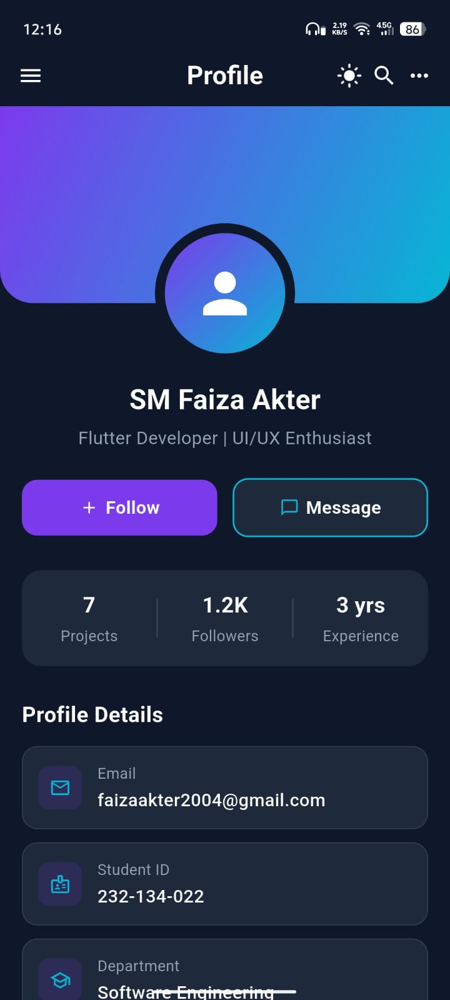
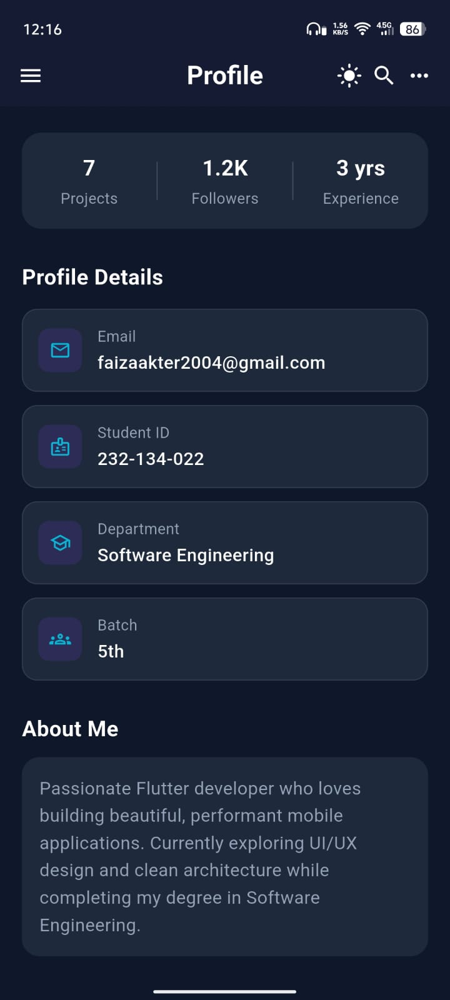
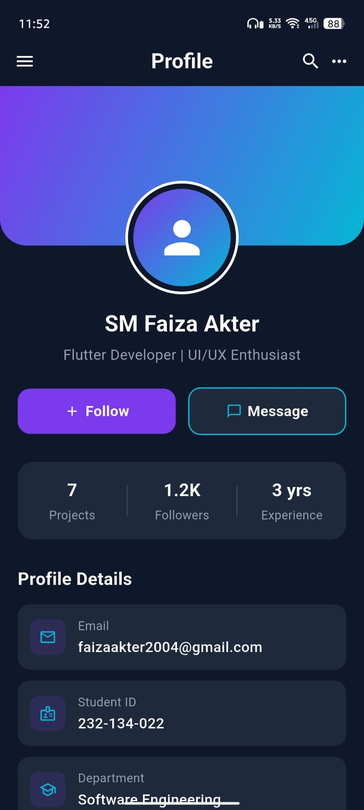
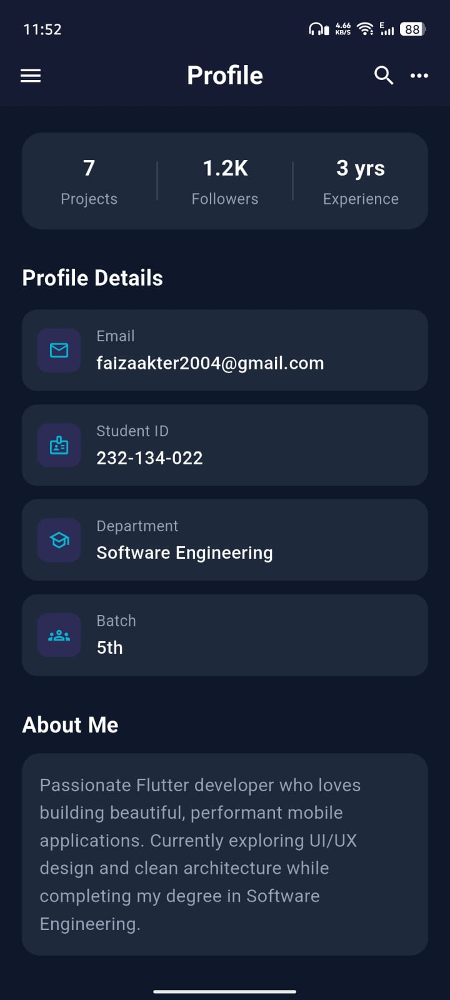

# Flutter Profile Screen UI

A modern, premium Profile Screen UI built with Flutter — featuring a purple-cyan gradient header, profile statistics, profile details, an About Me section, an interactive Follow button, and a full Light/Dark mode toggle.

This project was built as part of a university Flutter task, focusing on core Flutter widgets and `setState()` for state management.

---

## 📱 Screenshots

### 🌙 Dark Mode
<p align="center">
  
  &nbsp;&nbsp;
  
</p>

### ☀️ Light Mode
<p align="center">
  
  &nbsp;&nbsp;
  
</p>

---

## ✨ Features

- Premium dual theme (Dark & Light) with purple-cyan gradient header
- Light/Dark mode toggle in the AppBar using `setState()`
- Stylish circular profile picture placeholder built with `Stack` and `Positioned`
- Statistics section (Projects, Followers, Experience)
- Profile details section (Email, Student ID, Department, Batch)
- Follow / Message action buttons
- Follow button toggles state (Follow ↔ Following) using `setState()`
- About Me section
- Fully scrollable, responsive layout with `SingleChildScrollView`

---

## 🎨 Color Theme — "Cyan Edge"

The app uses a custom dual-theme color system that adapts based on the selected mode.

### Dark Mode
| Element | Color |
|---|---|
| Background | `#0F172A` |
| Card Background | `#1E293B` |
| Primary Text | White |
| Secondary Text | `#94A3B8` |

### Light Mode
| Element | Color |
|---|---|
| Background | `#F0FDFF` |
| Card Background | `#FFFFFF` |
| Primary Text | `#0F172A` |
| Secondary Text | `#64748B` |

### Shared Accent Colors (Both Modes)
| Element | Color |
|---|---|
| Primary Accent (Purple) | `#7C3AED` |
| Secondary Accent (Cyan) | `#06B6D4` |

The gradient header (purple → cyan) and accent icons remain consistent across both themes, creating a unified "Cyan Edge" identity while the background, cards, and text adapt for readability and comfort.

---

## 🧩 Widgets Used

| Widget | Purpose in this Project |
|---|---|
| **Scaffold** | Provides the overall page structure (background, AppBar, body) |
| **AppBar** | Top navigation bar containing the menu icon, title, theme toggle, search, and more-options icons |
| **Stack** | Layers the gradient header and the profile picture on top of each other |
| **Positioned** | Places the profile picture so it overlaps the header and body sections |
| **Container** | Used throughout for backgrounds, cards, gradients, borders, and rounded corners |
| **Column** | Arranges widgets vertically (name, profession, sections, etc.) |
| **Row** | Arranges widgets horizontally (action buttons, stats, detail rows) |
| **Expanded** | Distributes equal width to Follow/Message buttons and stat items |
| **Padding** | Adds spacing around sections and elements |
| **SizedBox** | Creates fixed vertical/horizontal gaps between elements |
| **Center** | Centers content such as icons and text inside containers |
| **Text** | Displays name, profession, labels, values, and descriptions |
| **Icon** | Displays profile, menu, search, theme toggle, and detail-row icons |
| **GestureDetector** | Detects taps on the Follow button and the light/dark mode toggle |
| **SingleChildScrollView** | Makes the entire profile screen scrollable to prevent overflow |
| **setState()** | Manages two interactive states: Follow ↔ Following toggle, and Dark ↔ Light mode toggle |

---

## 🛠️ Built With

- [Flutter](https://flutter.dev/)
- Dart
- Core Flutter widgets only — no external packages or state management libraries

---

## 🚀 Getting Started

### Prerequisites
- [Flutter SDK](https://docs.flutter.dev/get-started/install) installed
- An emulator or physical device

### Run the project

```bash
git clone https://github.com/Faiza-Akter/Flutter_profile_task_1.git
cd Flutter_profile_task_1
flutter pub get
flutter run
```

---

## 📂 Project Structure
lib/
└── main.dart   # Contains the entire Profile Screen UI (dark & light mode)


---
## 👩‍💻 Author

SM Faiza Akter Borsha<br>
ID: 232-134-022<br>
Batch SWE-5th<br>
Metropolitan University
---
